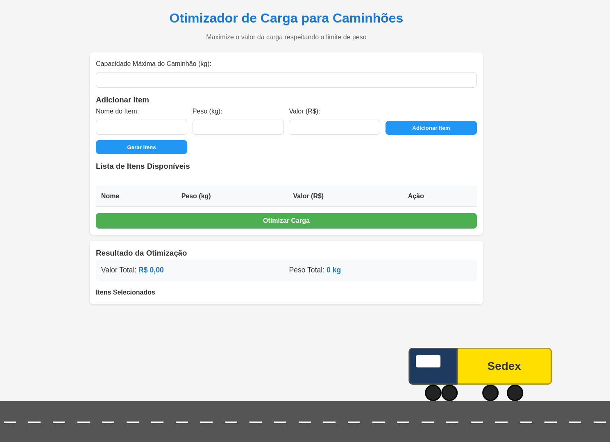
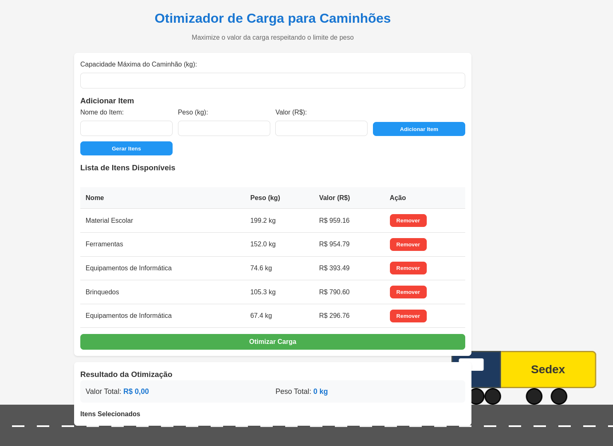
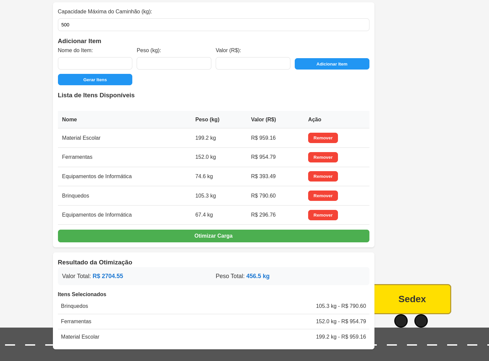

# PD - Programação Dinâmica

**Número da Lista**: 5 
**Conteúdo da Disciplina**: Programação Dinâmica 

## Alunos

| Matrícula | Aluno                                |
| --------- | ------------------------------------ |
| 211031771 | Lucas Lopes Frazão                   |
| 211031459 | Pedro Henrique Rodrigues de Carvalho |

## Sobre 

O objetivo do nosso projeto foi implementar o algoritmo KnapSack DP. Através dele, buscamos otimizar a carga de um caminhão, considerando o peso e valor dos itens, além do limite de peso do caminhão. O resultado final é uma lista de itens selecionados, gerando o maior lucro possível, considerando a restrição de peso.

## Screenshots

## Vídeo

[Acesse o vídeo](https://youtu.be/jUkINFIyPfE)

## Instalação 
**Linguagem**: Javascript 
**Sistema Operacional**: Sem restrição 

## Passo a passo

Não há a necessidade instalar, pois o projeto está rodando no deploy do próprio github, no link abaixo:

[Acesse o deploy]()

Porém, caso queira rodar o projeto localmente, segue os passos abaixo:

1. Clone o repositório
`
git clone https://github.com/lucasfrazao/PA_5.git
`

2. Abra o index.html em qualquer navegador (é importante que o html, css e js estejam na mesma pasta)

## Uso 

1. Insira o peso limite do caminhão na caixa de texto no topo.

2. Insira o peso e o valor de cada item e adicione na listagem ou utilize o botão "Gerar Itens".

3. Clique no botão "Otimizar Carga"

4. Visualizar os Resultados